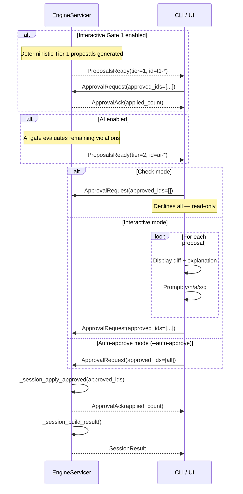

# 10 — Human Approval Flow

> Previous: [09 — Post-AI Deterministic Pass](09-post-ai-deterministic.md) | Next: [11 — Result Assembly](11-result-assembly.md)

## Purpose

AI-generated fixes require human review before being applied. In ADR-062
Phase 3 interactive mode, deterministic Tier 1 changes are also offered as
Gate 1 proposals before any file writes occur. This stage covers how
proposals are presented, how approvals/rejections are processed, and how
check mode, interactive mode, and auto-approve mode differ.

## Sequence



## ProposalsReady Event

When the graph engine produces AI proposals, the Engine converts them to
`Proposal` proto messages and emits a `ProposalsReady` event:

```protobuf
message Proposal {
  string id = 1;           // "t1-0000" (Gate 1) or "ai-0000" (Gate 2)
  string file = 2;
  string rule_id = 3;
  int32 line_start = 4;
  int32 line_end = 5;
  string before_text = 6;  // Original YAML
  string after_text = 7;   // Proposed YAML
  string diff_hunk = 8;    // Unified diff
  float confidence = 9;
  string explanation = 10;
  int32 tier = 11;          // 1 deterministic, 2 AI
  string status = 12;       // "proposed"
  string source = 14;       // "deterministic" (t1-*) or "ai" (ai-*)
  string path = 15;         // stable node identity path
}
```

Proposal IDs follow `t1-NNNN` for deterministic Gate 1 and `ai-NNNN` for
AI Gate 2 (zero-padded indices).

## Check Mode

In check mode (no `FixOptions`), the CLI automatically declines all proposals:

```python
if oneof == "proposals":
    cmd_queue.put(SessionCommand(approve=ApprovalRequest(approved_ids=[])))
```

This ensures `check` is always a read-only assessment — it shows what
remediation would change without making any modifications.

## Interactive Review

`src/apme_engine/cli/remediate.py` — `_interactive_review()` presents each
proposal with:

- Rule ID, file path, line range, confidence score
- Explanation text
- Unified diff hunk

User choices:

| Key | Action |
|-----|--------|
| `y` | Accept this proposal |
| `n` | Skip this proposal |
| `a` | Accept all remaining proposals |
| `s` | Skip all remaining proposals |
| `q` | Abort the entire review |

Returns a list of approved proposal IDs.

## Auto-Approve Mode

With `--auto-approve`, all proposals are accepted without review:

```python
if getattr(args, "auto_approve", False):
    approved = [p.id for p in proposals]
```

Useful for CI pipelines where human review is not practical.

## Applying Approvals

`EngineServicer._session_apply_approved()` processes the `ApprovalRequest`:

### Graph-Based Proposals (Tier 1 + AI)

For proposals with `id` starting with `"t1-"` or `"ai-"`:

1. Map proposal IDs back to graph node IDs via `proposal_node_map`
2. For approved proposals: `graph.approve_node(node_id)` — promotes the
   latest progression entry
3. For rejected proposals: `graph.reject_node(node_id)` — reverts to the
   last approved state
4. Re-splice modifications to update working files

### Legacy Text-Based Proposals

For non-graph proposals (backward compatibility), uses text-based
find/replace on `session.working_files`.

## Session Status Transitions

```
PROCESSING → AWAITING_APPROVAL (Gate 1 t1-* proposals, interactive mode)
AWAITING_APPROVAL → PROCESSING (Gate 2 AI after Gate 1 approval, when enabled)
PROCESSING → AWAITING_APPROVAL (Gate 2 ai-* proposals)
AWAITING_APPROVAL → COMPLETE (after final approval processing)
```

If no proposals are generated in a gate, that gate is skipped and the session
can proceed directly to the next stage or COMPLETE.

## Gateway/UI Approval

The Gateway bridges WebSocket connections to the `FixSession` gRPC stream.
The approval flow is the same — `ApprovalRequest` with approved IDs — but
delivered via WebSocket message instead of CLI prompt.

### Standalone SPA (ADR-062 Option C + ADR-064)

The native UI **Scan** button starts `check` with `options.assess_pause: true`
(ADR-064). The engine emits `FindingsReady`, the Gateway SSE status becomes
`assessed`, and the SPA shows findings (flat or group-by-node). **Remediate**
calls `POST .../begin-remediate` on the same FixSession (no full rescan while
the session is alive), then Gate 1 Tier 1 proposals pause for per-node Accept /
Decline. An **Auto-apply Tier 1** toggle sets `interactive: false` for the
legacy auto-apply path after begin-remediate.

Plain `check` without `assess_pause` still completes immediately (CLI/portal
unchanged). Gateway `interactive` remains default **false**.

Per-node review UX and proposal helpers live in `frontend/src/remediation/`.
Suppress/Acknowledge on historical violations lists is a separate surface and
is not offered on Gate 1 node cards.

## Key Source Files

| File | Key types/functions |
|------|---------------------|
| `src/apme_engine/daemon/engine_server.py` | `_session_apply_approved()`, `_build_graph_proposals()`, `_apply_graph_approvals()` |
| `src/apme_engine/cli/remediate.py` | `_interactive_review()`, `_prompt_ynasq()` |
| `src/apme_engine/cli/check.py` | Auto-decline on `proposals` event |
| `proto/apme/v1/engine.proto` | `Proposal`, `ProposalsReady`, `ApprovalRequest`, `ApprovalAck` |

## Related ADRs

- **ADR-028** — FixSession bidirectional streaming
- **ADR-039** — Unified check/remediate through FixSession

---

> Next: [11 — Result Assembly](11-result-assembly.md)
